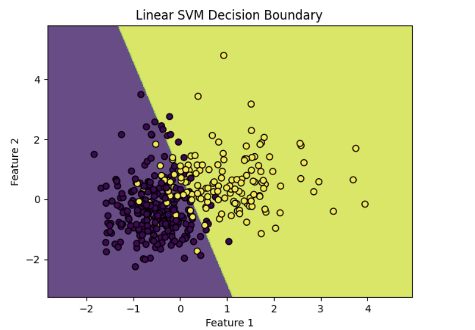

# SVM Classification on Breast Cancer Dataset

This project applies Support Vector Machine (SVM) classification on a breast cancer dataset. It demonstrates model training, evaluation, visualization, and hyperparameter tuning.

---

## Objectives

- Load and preprocess a breast cancer dataset
- Train SVM models using **linear** and **RBF** kernels
- Visualize the decision boundaries using **2D feature space**
- Perform **hyperparameter tuning** using `GridSearchCV`
- Evaluate model performance using **accuracy** and **classification report**

---

## Workflow Summary

1. Upload and load the breast cancer dataset (CSV)
2. Clean the dataset and map diagnosis labels (M → 1, B → 0)
3. Split the data into training and testing sets
4. Scale the features using `StandardScaler`
5. Train two Support Vector Machine models:
   - Linear kernel
   - RBF (Radial Basis Function) kernel
6. Visualize decision boundaries using the first two features
7. Tune hyperparameters (`C`, `gamma`) using `GridSearchCV`
8. Evaluate the best model on test data using accuracy and classification report

---

## Dataset

- The dataset used contains features extracted from breast cancer cell images.
- Binary classification:  
  - **M** (Malignant) → `1`  
  - **B** (Benign) → `0`

---

## Model Training

- Two SVM models were trained:
  - Linear kernel
  - RBF (Radial Basis Function) kernel
- Feature scaling applied using `StandardScaler`

---

## Visualization

Two separate decision boundary plots were generated:
- One for the **Linear SVM**
- One for the **RBF SVM**

These visualizations use the **first two features** from the dataset for 2D plotting.

---

## Hyperparameter Tuning

- Used `GridSearchCV` with cross-validation (`cv=5`)
- Parameters tuned:
  - `C`: [0.1, 1, 10]
  - `gamma`: [0.01, 0.1, 1]

---

## Evaluation

- Accuracy score on test set
- Classification report including:
  - Precision
  - Recall
  - F1-score

 ---
 
## Visuals

Decision boundary plots using the first two features:

  
  

---

## Notes

- PCA was **not used** in this project.
- Decision boundary plots are based on **real features**, not dimensionality reduction.

---

